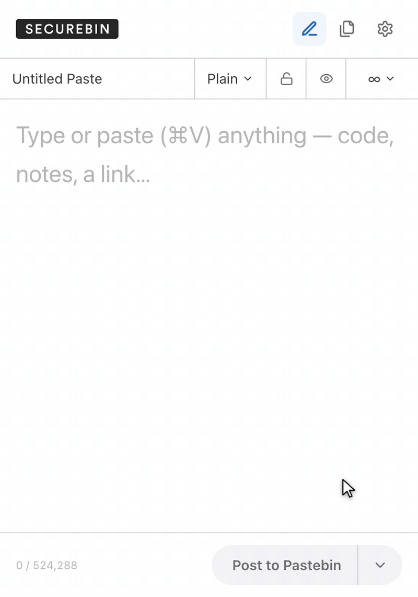
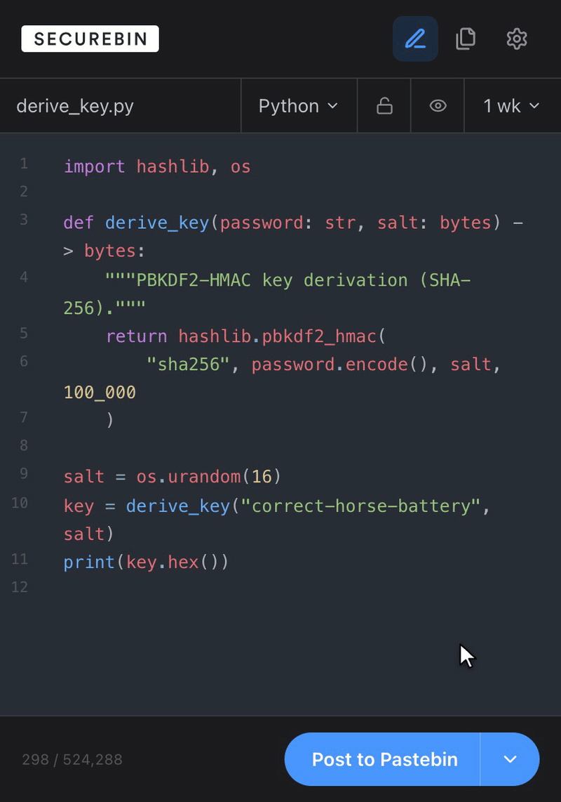

# securebin

<a href="https://chrome.google.com/webstore/detail/securebin/ehjclckbpmkgjgfnebopjlilpdbjjpjj" target="_blank" rel="noreferrer noopener"></a>


securebin is a Google Chrome extension for interfacing securely with PasteBin.

Users can encrypt plaintext and have it stored onto PasteBin, where they can copy the link and key to send it to another user for decryption. Encryption happens locally in your browser with the Web Crypto API (AES-GCM by default) — the plaintext never leaves your machine.

securebin works out of the box; add your own [PasteBin API key](https://pastebin.com/doc_api#1) in Settings to post under your account.

To learn more about our project and the design decisions check out the [Wiki page.](https://github.com/secbin/extension/wiki)

| Pastebin client | Secure mode |
| --- | --- |
|  |  |
| Post code or notes straight to Pastebin — formats, expiry, and visibility included. | Encrypt locally with AES-GCM first; only ciphertext ever reaches Pastebin. |

## How to Install this extension:

You can grab a prebuilt version of this extension under the release tab or build it yourself.

The current extension (v2) lives in [`v2/`](v2/) — see [v2/README.md](v2/README.md) for build instructions:

```
$ cd v2
$ npm install
$ npm run build
```

Then load the generated `v2/dist` folder via `chrome://extensions` → Developer mode → Load unpacked.
